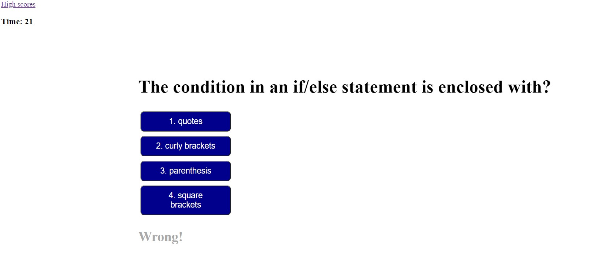
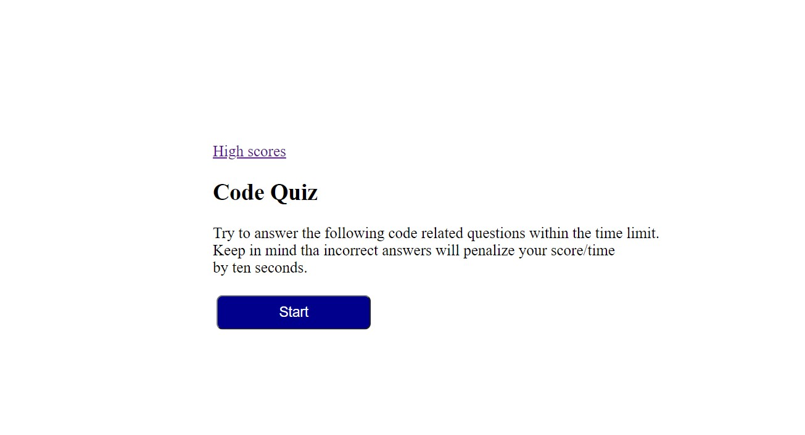
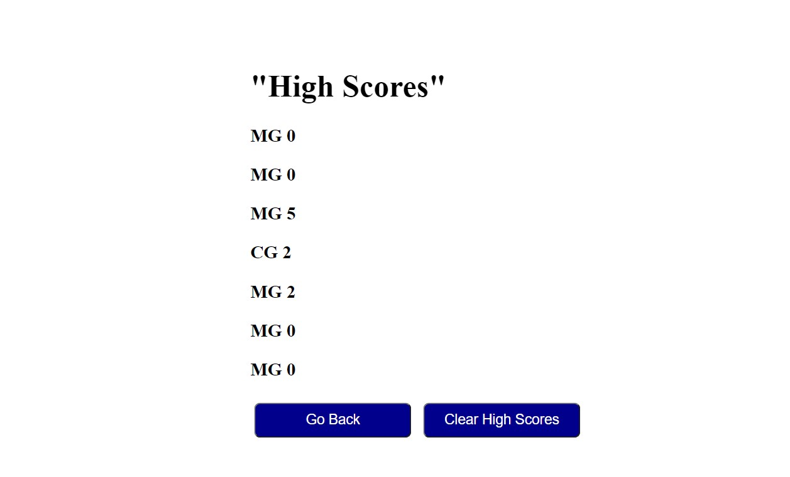
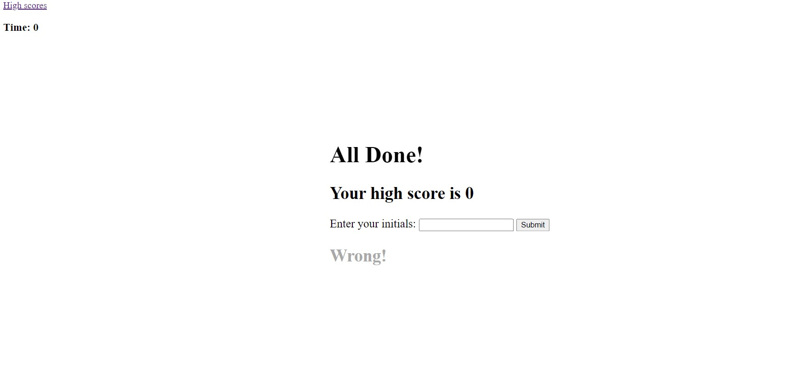

# code-quiz
I created a timed quiz for a boot camp student.At the end of the quiz the user will be able to check his/her score and a list of the latest scores.
## Languajes
HTML,CSS, JavaScript. 
##  link
The page can be found at:
<a href="https://martha121.github.io/code-quiz/"> martha121.github.io/</a>

# Screenshot

